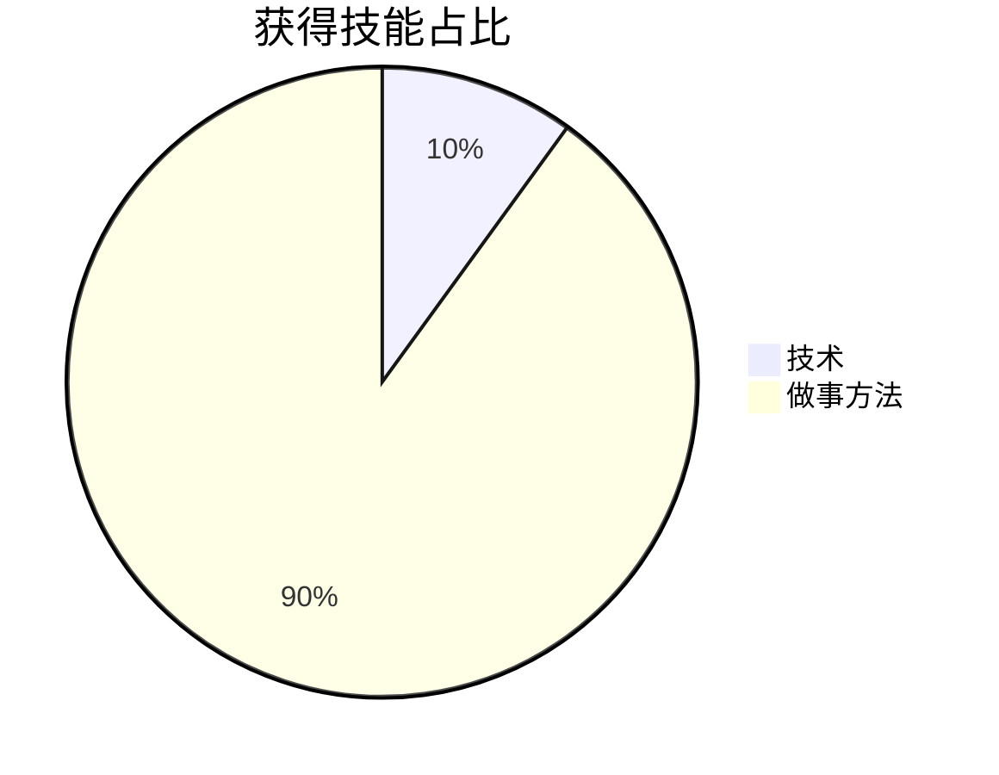

有哪些技术呢？

1.整机是可以配置双电源的

2号电源，短接3-4口给显卡供电👇
1号电源，被开机按钮启动给主板供电

建议两个电源，是同款

2.固件升级时，除非主板有设计双BIOS芯片，不然升级过程，最好守着别让它关机了

如果就是关了呢？那主板就报废了。只能通过特殊的烧录工具，去写入BIOS or 售后换个主板。烧录工具一般不外传，不愿意折腾的人走售后吧

3.整机背面的USB接口速率比前面的快。因为背面是焊在板子上的，前面是通过线接到主板。

同理有些笔记本，内存颗粒直接焊在板子上，你说它不能灵活升级内存吧，那确实没辙。但是你要比内存跑分，那就是弯道超车。

有哪些做事方法呢？

整机故障的维修思路：
1.判断是否为特殊环境引起？如网络、断电/强制关机、客户忘记插线/错误插线等
2.判断BUG是硬件（处理器、内存、固态、线等）引起还是软件（操作系统、驱动、APP等）

text